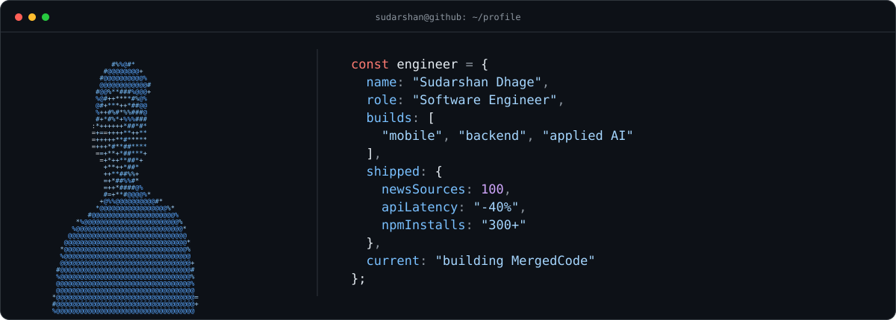

<picture>
  <source media="(prefers-color-scheme: dark)" srcset="./assets/profile-dark.svg">
  <source media="(prefers-color-scheme: light)" srcset="./assets/profile-light.svg">
  
</picture>

  <a href="mailto:sudarshan096k@gmail.com">Email</a> ·
  <a href="https://linkedin.com/in/sudarshan-dhage">LinkedIn</a> ·
  <a href="https://github.com/SudarshanDhage">GitHub</a> ·
  <a href="https://x.com/DhageSudarshan_">X</a>

## Building across the product

I'm a software engineer at **Obvitree**, where I own features across Flutter, Next.js, and Node.js—from requirements and architecture through deployment and incident resolution. My work sits at the intersection of product engineering, distributed data pipelines, and applied AI.

I have shipped mobile and web experiences, retrieval-augmented AI systems, internal operations platforms, and ingestion infrastructure running across more than 100 sources. Outside work, I build and release products independently.

## Selected engineering work

### [MergedCode](https://mergedcode.com) — software engineering learning workspace

Solo-built a unified workspace for DSA, core computer science, system design, AI learning, Kanban planning, calendars, and visual canvases.

- Ships as a **Next.js web client** and **Flutter Android app**, backed by one Hono/TypeScript API.
- Uses Firebase Authentication, Upstash Redis rate limiting, Razorpay and RevenueCat billing.
- Runs across Cloudflare Workers, R2, and Google Cloud Run in a monorepo with shared TypeScript logic.

`Next.js` `React` `TypeScript` `Flutter` `Hono` `Firebase` `Cloudflare` `GCP`

### NoteForge — PDF to Obsidian vault generator

Built a React application, FastAPI service, and npm CLI that turn PDFs into linked Obsidian vaults and knowledge graphs.

- Reduced token costs by **70–80%** through global concept seeds and batched extraction.
- Improved processing speed by **70%** with parallelization and embedding deduplication.
- Generates **100+ node graphs in under one minute** and reached **300+ installs**.
- Uses an event-driven QStash, Lambda, and R2 pipeline with pgvector RAG for on-demand notes.

`Python` `FastAPI` `React` `PostgreSQL` `pgvector` `Redis` `AWS Lambda` `Cloudflare R2`

### ClassAsk — live classroom Q&A

Built and deployed a real-time platform for student and professor interaction, including speech input and AI-generated responses.

- Uses WebSockets for live questions and updates.
- Applies agentic AI and RAG to summarize questions, classify topics, flag urgency, and generate quizzes.
- Uses SentenceTransformers to retrieve relevant context from course material.

`Python` `FastAPI` `WebSockets` `SentenceTransformers` `RAG` `LLMs`

## Production highlights

- Architected fault-tolerant Puppeteer ingestion for **100+ news sources** with source-specific parsers, retries, deduplication, and scheduling.
- Delivered an AI crypto Q&A system using Qdrant retrieval and multiple LLM providers across the product UI and backend APIs.
- Built a secure Next.js operations platform with fine-grained RBAC, AI-assisted moderation, and product-wide operational tracking.
- Shipped a Flutter crypto application with personalized news, courses, quizzes, portfolio tracking, and price alerts for **100+ cryptocurrencies**.
- Reduced API response times by **40%**.
- Owned Docker-based delivery, GitHub Actions pipelines, observability, and Play Store and App Store releases.

## Technical range

| Area | Tools |
| :-- | :-- |
| **Languages** | Python, TypeScript, JavaScript, Java, SQL, Dart |
| **Product clients** | Flutter, Next.js, React, Zustand, TanStack Query |
| **Services and APIs** | Node.js, Express, Hono, FastAPI, GraphQL, REST, WebSockets, Temporal |
| **AI and retrieval** | RAG, Qdrant, pgvector, SentenceTransformers, LangChain, Gemini, Grok, OpenRouter |
| **Data** | PostgreSQL, MySQL, Firestore, Redis, Supabase |
| **Cloud and delivery** | Docker, GitHub Actions, Cloud Run, Cloudflare Workers, R2, AWS EC2, Lambda, Firebase |

## Background

**B.Tech. in Robotics and Automation Engineering**  
Bharati Vidyapeeth, Pune · 2020–2024 · CGPA: **9.42/10**

---

The portrait above is generated locally from a private source photo. The repository stores only syntax characters inside theme-aware SVGs—not the original image. Rebuild it with <code>python scripts/generate_ascii_hero.py /path/to/portrait.png</code>.

